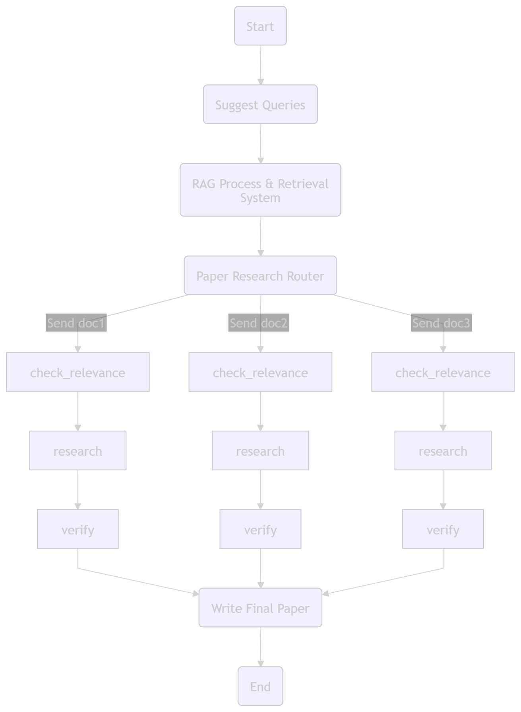

# ResearcherAgent 🧠📚

Have you ever wondered if an AI agent could operate not just as a search engine, but as a dedicated research assistant that reads, verifies, and synthesizes complex academic literature into a coherent final paper? 🤔

**ResearcherAgent** is a **completely open-source and free** autonomous multi-agent system. Built using **LangGraph** and **LangChain**, it orchestrates the entire research lifecycle: from query expansion and parallel document retrieval to critical analysis, verification, and final synthesis. By leveraging hybrid retrieval strategies and a robust multi-agent architectural pattern, this system ensures that information gathered is not only relevant but also rigorously vetted. ✅

---

## Workflow Architecture 🔄

The following diagram illustrates the agentic workflow, highlighting the parallelized processing of retrieved documents via the `Send` API.


---

## Getting Started 🚀

### Prerequisites ⚙️

1. **Python:** Ensure you have [Python 3.10+](https://www.python.org/) installed. 🐍
2. **Ollama:** You will need [Ollama](https://ollama.com/) running locally. 💻
3. **Model Setup:** This agent is optimized to run with **Llama 3.2** and **embeddinggemma**. Pull the model to your local machine before starting:

```bash
ollama pull llama3.2
ollama pull embeddinggemma
```

---

### Installation 🛠️

1. **Clone the repository:**

```bash
git clone https://github.com/hasibullahmohmand/ResearcherAgent.git
cd ResearcherAgent
```

2. **Set up the virtual environment:**

```bash
python -m venv venv
```

* On Windows:

```bash
venv\Scripts\Activate.ps1
```

* On macOS/Linux:

```bash
source venv/bin/activate
```

3. **Install dependencies:**

```bash
pip install -r requirements.txt
```

4. **Install Spacy:**
   The `SpacyTextSplitter` is utilized for precise chunking of academic papers. Download the required language model:

```bash
pip install spacy
```

---

## Technical Highlights ✨

* **Open-Source Stack:** Built entirely on **LangChain** and **LangGraph**, providing a modular, transparent, and extensible foundation. 🧩
* **Parallel Processing:** Utilizing LangGraph’s `Send` API to process multiple papers simultaneously, significantly reducing total research time. ⚡
* **Hybrid Retrieval:** Implements an `EnsembleRetriever` combining BM25 (keyword-based) and MMR (semantic-based) via ChromaDB to maximize the precision of retrieved document chunks. 🏹
* **Dual-State Management:** Uses two distinct state graphs (`AgentState` and `PaperState`) to maintain separation between the overall research coordination and individual document analysis. 📊
* **Agentic Verification:** Includes a dedicated verification agent that checks draft quality and relevance, creating a feedback loop that forces the research agent to re-research if the initial draft is insufficient. ✅

---

## Usage 📝

### Running the Application

You have two options for interacting with the ResearcherAgent:

1. **Gradio Interface (Frontend):**
   For a user-friendly web interface, run the Gradio app found in `app.py`:

```bash
python app.py
```

Access the UI at the URL provided in your terminal (typically `http://127.0.0.1:7860`). 🌐

2. **FastAPI Integration (Backend):**
   If you wish to integrate this agent into your own services, run the FastAPI application found in `api.py`:

```bash
python api.py
```

This exposes the agent's functionality via REST endpoints, allowing you to trigger research tasks programmatically. 🖥️
